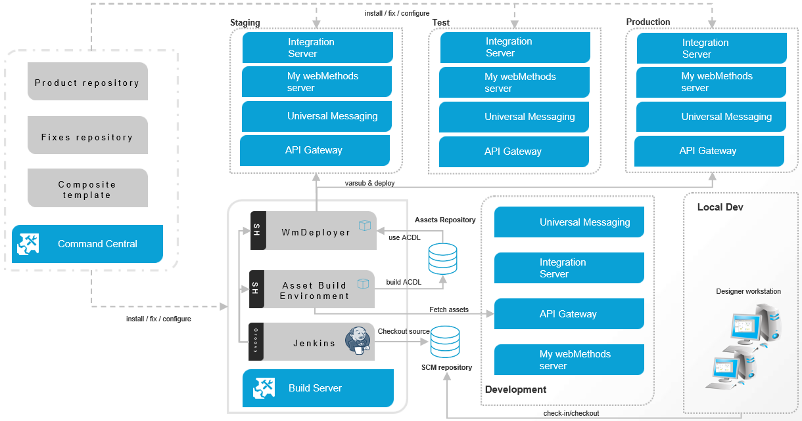
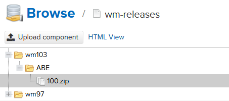
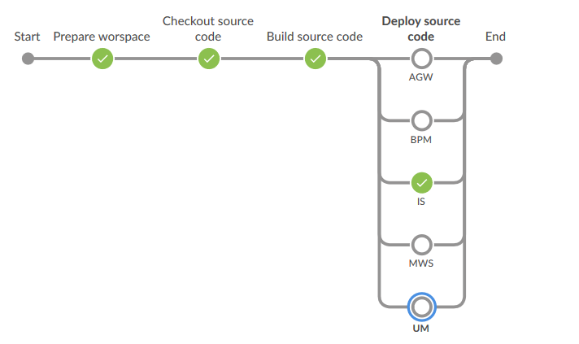

# webMethods CICD sample framework

## Overview

This project is a framework that aims to implement continuous integration on webMethods platform using Jenkins installed on the same server as webMethods components (Asset Build Environment and WmDeployer)

## Architecture



Command Central is not covered in this demo.

## Requirements

* Jenkins : 2.190 or above with following plug-ins and dependencies

```
scm-api
git-client
git
blueocean
pipeline-utility-steps
pipeline-rest-api
ssh-credentials
jdk-tool
ws-cleanup
antisamy-markup-formatter
```

* webMethods installation : 10.x ( 10.1 and above)

   * Integration Server : with Asset Build Environment and WmDeployer installed, this instance is used for build and deploy purpose

## Supported assets

The following assets can be deployed with this framework : 

* BPM : Process models
* IS : Integration server packages and configurations files (as supported by Asset Build environment)
* UM : Universal Messaging assets
* MWS : My webMethods server assets (Portlet, War...)
* AGW : API Gateway assets

## Configuration

### Jenkins global configuration

Jenkins should be running with the same user as the webmethods components in order to avoid permission issues

Add the different credentials that will be used by the framework (Jenkins > Credentials > Add Credentials) : 

* Create a credential for the repository where the framework is located
* Create a credential for each asset repository (A single credential can be used, if authentication information is the same for the different repositories)

### Update Jenkinsfile

After check-in of the framework a on git repository, the following variables need to be updated in Jenkinsfile : 

```
def repoUtilsUrl = <GIT_REPOSITORY_URL>
def repoUtilsBranch = <GIT_BRANCH>
def repoUtilsCredential = <GIT_CREDENTIAL>
```

Where :

* GIT_REPSOITROY_URL : git repository url where the framework is located
* GIT_BRANCH : git repository branch to checkout
* GIT_CREDENTIAL : git credential ID as configured in the Jenkins instance

These information will be used to checkout and populate the parameters fields for the job by reading the properties files located in "parameters" folder.

### Update build_\<env\>.properties

In order to configure the environment update build_<env>.properties file located in "properties" folder. 

#### Workspace 

Define a CICD workspace root folder with the following properties

```
dir.workspace=<DIRECTORY_WS>
```

Jenkins pipeline will create automatically all subdirectories  : 

* source : source code checkout folder
* builds : composites repository folder (generated by Asset Build Environment)
* archive : archived build folder
* logs : build output logs folder

#### Git repositories 

Adding a git repository (containing assets to build) consists on updating the following properties : 

```
repo.url.<MODULE>=<GIT_REPOSITORY_URL>
repo.credential.<MODULE>=<GIT_CREDENTIAL>
dir.<MODULE>=<DIRECTORY_ASSET>
```

Where :

* GIT_REPSOITROY_URL : git repository url where the assets are located
* GIT_CREDENTIAL : git credential ID as configured in the Jenkins instance
* DIRECTORY_ASSET : assets checkout folder
* MODULE : Module name as defined in "parameters/module.properties" file

Folders structure can be updated according to your needs, for example :

```
## IS (packages and config directory)
dir.asset.is=packages
## BPM (Process models projects)
dir.asset.bpm=bpm
## UM (realm export)
dir.asset.um=um/UniversalMessaging
## MWS (CAF)
dir.asset.mws=mws
## AGW (json extraction file)
dir.asset.agw=api
```

Which corresponds to an assets repository having the following structure

```
ROOT_FOLDER/
           api
             /api.json
           packages
             /config
             /package1
             ...
             /packageN
           bpm
             /ProcessProject1
             ...
             /ProcessProjectN
           um
             /UniversalMessaging/reaml_export.xml
           mws
             /PortletProject1
             ...
             /PortletProjectN
```

#### Integration Server (Build) configuration

Update the following properties used to invoke Integration Server having Asset Build Environment and WmDeployer installed : 

```
dir.install.build=<SAG_INSTALL_DIR>
dir.install.deployer=<SAG_DEP_PATH>
deployer.host=<DEP_HOST>
deployer.port=<DEP_PORT>
deployer.user=<DEP_USER>
deployer.pwd=<DEP_PWD>
```

Where :

* SAG_INSTALL_DIR : root installation directory
* SAG_DEP_PATH : relative path to WmDeployer root directory (IntegrationServer/instances/<INSTACE>/packages/WmDeployer)
* DEP_HOST|PORT|USER|PWD : WmDeployer parameters

#### Target servers configuration

Update the following properties used to connect to the different components: 

```
target.alias.<COMPONENT>=<TARGET_ALIAS>
target.host.<COMPONENT>=<TARGET_HOST>
target.port.<COMPONENT>=<TARGET_PORT>
target.user.<COMPONENT>=<TARGET_USER>
target.pwd.<COMPONENT>=<TARGET_PWD>
target.version.<COMPONENT>=<TARGET_VERSION>
target.ssl.<COMPONENT>=false|true
```

Where COMPONENT can have the following values : 


* is : Integration Server target
* bpm : Process Engine target
* um : Universal Messaging target
* mws : My webMethods server target
* agw : API Gateway server target

For API Gateway only, update the following properties in order to extract assets from a source API Gateway : 

* source.url.agw : source API Gateway URL
* source.user.agw : source API Gateway user
* source.pwd.agw: source API Gateway password
* source.assets.file.agw : json extraction file (refer to API Gateway documentation) 

#### Artifact repository configuration (Nexus)

Update properties used for Nexus upload : 

```
repo.artifact.credential=<NEXUS_CREDENTIAL>
repo.artifact.url=<NEXUS_URL>
repo.artifact.path.abe=<NEXUS_FOLDER_ABE>
```

Where :

* NEXUS_CREDENTIAL : Credential id used to connect to Nexus repository (basic authentification)
* NEXUS_URL : URL of the repository
* NEXUS_FOLDER_ABE : Folder where ACDL build output will be stored



### Jenkins job 

Create a Jenkins job (New item > Pipeline) and under Pipeline define the following 

```
Definition : Pipeline script from SCM
Definition > SCM : git
Definition > SCM > Repositories > Repository URL : <GIT_REPOSITORY_URL>
Definition > SCM > Repositories > Credentials : <GIT_CREDENTIAL>
Definition > SCM > Branches to build : <GIT_BRANCH>
Definition > Script Path : <PATH_SCRIPT>
```
Where :

* GIT_REPSOITROY_URL : git repository url where the framework is located
* GIT_BRANCH : git repository branch to checkout
* GIT_CREDENTIAL : git credential ID as configured in the Jenkins instance
* PATH_SCRIPT : relative path to Jenkins file (e.g : wm/repository/Jenkinsfile)

## Running Jenkins job 

Run created job by providing inputs parameters :

* MODE : Build or Build and Deploy
* BUILD_VERSION : Build version (xxx)
* MODULE : module to build (values defined in parameters/module.properties file)
* BRANCH : module branch to build (values defined in parameters/branches.properties file)
* ENVIRONMENT : target environment
* ENABLE\_IS\_BUILD : Integration server build (true|false)
* ENABLE\_BPM\_BUILD : Process models build (true|false)
* ENABLE\_MWS\_BUILD : My webMethods Server build (true|false)
* ENABLE\_UM\_BUILD : Universal Messaging build (true|false)
* ENABLE\_AGW\_BUILD : API Gateway build (true|false)

## Pipeline workflow



Depending on parameters provided as inputs, below stages will be executed :

1. Prepare workspace : always
2. Checkout source code : always
3. Build source code : always
4. Deploy source code : any of ENABLE\_xxx\_BUILD=true


_______________
DISCLAIMER
These tools are provided as-is and without warranty or support. Users are free to use, fork and modify them.